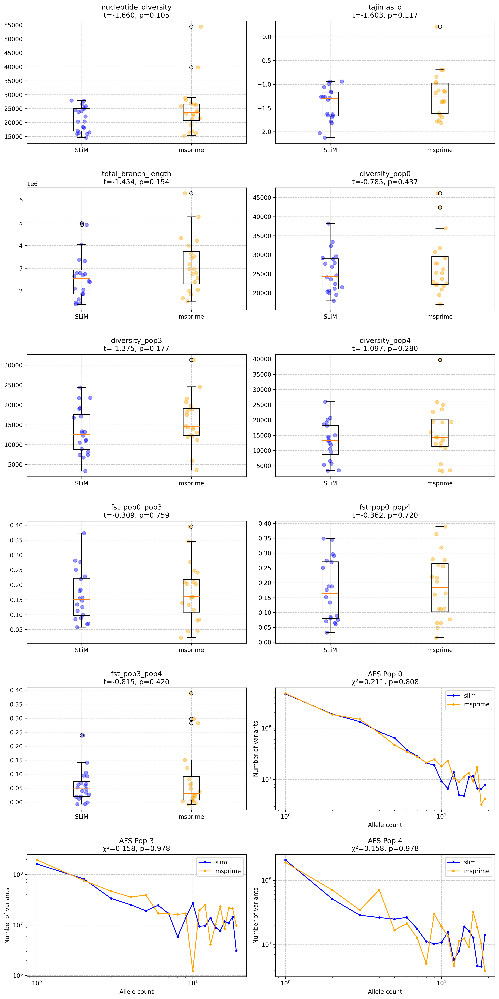
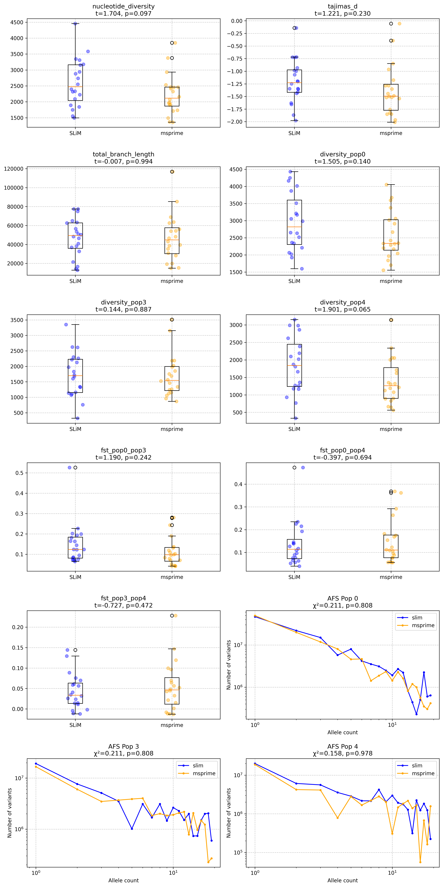

[](https://github.com/vsbuffalo/slimdemes/actions/workflows/ci.yml)

# slimdemes

This is a simple, *partial* implementation of
[demes](https://popsim-consortium.github.io/demes-spec-docs/main/introduction.html#sec-intro)
demographic models for SLiM. This is inspired by Graham Gower's
[deme-slims](https://github.com/grahamgower/demes-slim) which is a few years
old and not compatible with SLiM version 4. **Note that this implementation
does not support gene flow (e.g. the migrations and pulses blocks in the deme
specification), nor selfing/cloning rates.**

Validation and rescaling of a YAML demes file is done entirely through the
[demes](https://popsim-consortium.github.io/demes-docs/latest/introduction.html)
Python package. This is, in my view, a cleaner way to interface SLiM with
demes, since SLiM does not have native YAML parsing and requires that demes
YAML files be convert to JSON anyways. The `slimdemes convert` tool converts a
YAML demes model to JSON, removes the `migrations` and `pulses` blocks (since
these are not yet supported), and converts the demes `time_units` to
generations based on the generation time. Optionally, the demes model can be
rescaled too (which is done with Aaron Ragsdale's
[moments](https://momentsld.github.io/moments/api/api_demes.html#moments.Demes.DemesUtil.rescale)
library). Overall, this approach means shifting a lot of the demes handling to
well-established Python packages like `demes` and `moments`, rather than trying
to implement everything in SLiM's Eidos language.

The command line tool converts the

```
$ slimdemes convert --rescale-q 10 --out demes_q10.json --ignore-gene-flow demes.yaml
```

which runs

```python
slimdemes.convert_demes_to_json(input_file=input.yml,
                                ignore_gene_flow=True,
                                rescale_q=rescale_q,
                                out=output.json)
```


## Validation Plots




